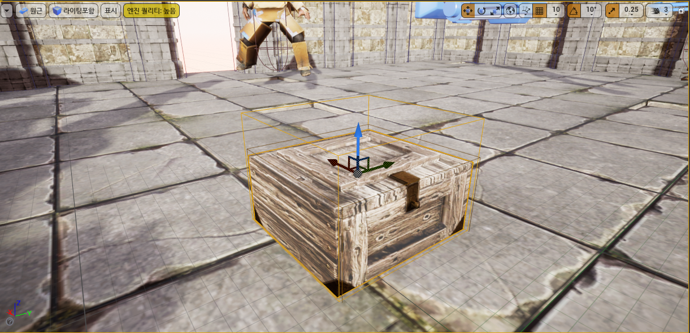

# ArenaBattle

## **05.28**

> **<h3>Today Dev Story</h3>**
- ### <span style = "color:yellow;">고정된 분수대의 구현</span>
   -  
   - 3개의 컴포넌트(스태딕 메시, 라이트, 파티클)을 할당하여 구현
   - 에셋의 경로를 컴포넌트로 바로 지정하여 생성가능하게 구현
      <details><summary>코드 보기</summary>

      ```c++
      //Fountain.h
      UPROPERTY(VisibleAnywhere)	//VisibleAnywhere->속성편집 가능하게 함, UPROPERTY->엔진이 컨트롤
      UStaticMeshComponent *Body;

      UPROPERTY(VisibleAnywhere)
      UStaticMeshComponent *Water;

      UPROPERTY(VisibleAnywhere)
      UPointLightComponent *Light;

      UPROPERTY(VisibleAnywhere)
      UParticleSystemComponent *Splash;

      UPROPERTY(EditAnywhere, Category=ID)
      int32 ID;
      //Fountain.cpp

      //컴포넌트를 생성하는 코드
         Body = CreateDefaultSubobject<UStaticMeshComponent>(TEXT("BODY"));
      Water = CreateDefaultSubobject<UStaticMeshComponent>(TEXT("WATER"));
      Light = CreateDefaultSubobject<UPointLightComponent>(TEXT("LIGHT"));
      Splash = CreateDefaultSubobject<UParticleSystemComponent>(TEXT("SPLASH"));

      //Body가 루트컴포넌트가 되며 Water는 Body의 자식이 된다.
      RootComponent = Body;
      Water->SetupAttachment(Body);
      Light->SetupAttachment(Body);
      Splash->SetupAttachment(Body);

      //좌표값 설정
      Water->SetRelativeLocation(FVector(0.0f,0.0f,135.0f));
      Light->SetRelativeLocation(FVector(0.0f,0.0f,195.0f));
      Splash->SetRelativeLocation(FVector(0.0f,0.0f,195.0f));

      //오브젝트의 키값을 가져와서 성공했다면 Body에 대입
      static ConstructorHelpers::FObjectFinder<UStaticMesh>
      SM_BODY(TEXT("/Game/InfinityBladeGrassLands/Environments/Plains/Env_Plains_Ruins/StaticMesh/SM_Plains_Castle_Fountain_01.SM_Plains_Castle_Fountain_01"));

      if(SM_BODY.Succeeded()) Body->SetStaticMesh(SM_BODY.Object);

      static ConstructorHelpers::FObjectFinder<UStaticMesh>
      SM_WATER(TEXT("/Game/InfinityBladeGrassLands/Effects/FX_Meshes/Env/SM_Plains_Fountain_02.SM_Plains_Fountain_02"));

      if(SM_WATER.Succeeded()) Water->SetStaticMesh(SM_WATER.Object);

      static ConstructorHelpers::FObjectFinder<UParticleSystem>
      SM_SPLASH(TEXT("/Game/InfinityBladeGrassLands/Effects/FX_Ambient/Water/P_Water_Fountain_Splash_Base_01.P_Water_Fountain_Splash_Base_01"));

      if(SM_SPLASH.Succeeded()) Splash->SetTemplate(SM_SPLASH.Object);
      ```

      </details>

- ### <span style = "color:yellow;">움직이는 액터 설계</span>
   - 
   1. 매크로를 사용하여 구현
      - Tick에서 구현하고 DeltaTime을 사용한다.
      - 컴포넌트를 추가하지 않아도 된다.
         <details><summary>코드 보기</summary>

         ```c++
         //Fountain.h
         private:
            UPROPERTY(EditAnywhere, Category=stat, Meta=(AllowPrivateAccess= true)) //private 타입이지만 Meta를 추가하여 접근가능
            float RotateSpeed;
         //Fountain.cpp
         AFountain::AFountain()
         {
            ...
            RotateSpeed = 30.0f;
         }
         void AFountain::Tick(float DeltaTime)
         {
            Super::Tick(DeltaTime);
            AddActorLocalRotation(FRotator(0.0f,RotateSpeed * DeltaTime,0.0f));  // Y, Z , X축 순서
         }
         ```

         </details>
      

   2. 무브먼트 컴포넌트 사용
      - Tick(Update)에서 사용하지 않아도 되고, DeltaTime을 사용하지 않는다.
      - 아래와 같이 다양한 움직임을 구사한다.
         - FloatingPawnMovement : 중력에 영향을 받지 않는 액터
         - RotatingMovement : 액터를 회전
         - InterpMovement : 액터를 지정된 좌표로 이동
         - ProjectMovement : 액터에 중력의 영향을 받아 포물선을 그리는 발사체 움직임

      <details><summary>코드 보기</summary>

      ```c++
      //Fountain.h
      #include "GameFramework/RotatingMovementComponent.h"
      ...
      UPROPERTY(VisibleAnywhere)
	   URotatingMovementComponent *Movement;
      //Fountain.cpp
	   Movement = CreateDefaultSubobject<URotatingMovementComponent>(TEXT("MOVEMENT"));
	   Movement->RotationRate = FRotator(0.0f,RotateSpeed,0.0f);
      ```

      </details>

- ### <span style = "color:yellow;">로그의 출력 방법</span>
   - 
   - 게임 모듈에 로그를 추가하고 다른 모듈에서 끌어다 쓴다.
   - 그렇기에 다른 모듈(cpp)에는 항상 게임 모듈을 넣어둔다.

      <details><summary>코드 보기</summary>

      ```c++
      //Arena.cpp
      #include "Arena.h"
      #include "Modules/ModuleManager.h"

      DEFINE_LOG_CATEGORY(Arena);   //추가된 부분
      IMPLEMENT_PRIMARY_GAME_MODULE( FDefaultGameModuleImpl, Arena, "Arena" );

      //Arena.h
      #pragma once

      #include "EngineMinimal.h"       //추가된 부분

      DECLARE_LOG_CATEGORY_EXTERN(Arena, Log, All);   //추가된 부분
      //메크로 선언
      #define ABLOG_CALLINFO (FString(__FUNCTION__) + TEXT("(") + FString::FromInt(__LINE__) + TEXT(")"))
      #define ABLOG_S(Verbosity) UE_LOG(Arena, Verbosity, TEXT("%s"), *ABLOG_CALLINFO)
      #define ABLOG(Verbosity,Format,...) UE_LOG(Arena, Verbosity, TEXT("%s %s"),*ABLOG_CALLINFO,*FString::Printf(Format, ##__VA_ARGS__))

      //Fountain.h
      #include "Arena.h" //기존 "EngineMinmal.h"가 아닌 "Arena.h"참조

      //Fountain.cpp
      void AFountain::BeginPlay()
      {
         Super::BeginPlay();

         //UE_LOG(Arena,Warning,TEXT("Actor Name : %s, ID : %d, Location X : %.3f"),*this->GetName(),ID,GetActorLocation().X); -> 이전 방식
         //최근 방식
         ABLOG_S(Warning);
         ABLOG(Warning, TEXT("Actor Name : %s, ID : %d, Location X : %.3f"),*this->GetName(),ID,GetActorLocation().X);
      }
      ```

      </details>


- ### <span style = "color:yellow;">GameMode & Pawn & PlayerController 설정</span>
   -  
   - ABGameMode, ABPawn, ABPlayerController을 생성하고 ABGameMode를 월드세팅에 GameMode에 넣어 룰을 지정한다.
   - ABPawn을 ABGameMode의 Default Pawn으로 지정한다. ABPlayerController또한 마찬가지 이다. (이때 생성이 아닌 클래스의 정보를 저장하는 것)
      <details><summary>코드 보기</summary>

      ```c++
      //ABGameMode.h
      class ARENA_API AABGameMode : public AGameModeBase
      {
         GENERATED_BODY()
      public:
         AABGameMode();
      };
      //ABGameMode.cpp
      #include "ABGameMode.h"
      #include "ABPawn.h"	      //내가 참조할것
      #include "ABPlayerController.h"

      AABGameMode::AABGameMode()
      {
         DefaultPawnClass = AABPawn::StaticClass();	//ABPawn의 클래스 정보를 저장 (멀티 플레이를 고려, 만들어두는 것이 아님)
         PlayerControllerClass = AABPlayerController::StaticClass();
      }
      ```

      </details>

- ### <span style = "color:yellow;">플레이어의 입장</span>
   -  
   - 플레이어가 로그인(입장)하면 언리얼 엔진에서 PostLogin 이벤트 함수가 호출된다. 
      - 이 과정에서 플레이어가 조종한 폰을 생성하고 플레이어 컨트롤러가 해당 폰에 빙의하는 작업이 이루어진다.
   - 각 생성되는 시점은 PostInitializeComponents, 빙의를 진행하는 시점은 PalyerController의 Posses, Pawn의 PossesedBy로 알 수 있다.
   - 아래는 PostLogin 이벤트 함수에 로그를 찍어서 플레이어 설정이 이루어지는 과정을 나타냈다.

      <details><summary>코드 보기</summary>

      ```c++
      //ABGameMode.h
      class ARENA_API AABGameMode : public AGameModeBase
      {
         GENERATED_BODY()
      public:
         AABGameMode();
      };
      //ABGameMode.cpp
      #include "ABGameMode.h"
      #include "ABPawn.h"	      //내가 참조할것
      #include "ABPlayerController.h"

      AABGameMode::AABGameMode()
      {
         DefaultPawnClass = AABPawn::StaticClass();	//ABPawn의 클래스 정보를 저장 (멀티 플레이를 고려, 만들어두는 것이 아님)
         PlayerControllerClass = AABPlayerController::StaticClass();
      }
      ```

      </details>
      
> **<h3>Realization</h3>**

- 유니티와 다르게 종류에 따라서 C++이 자동으로 생성된다.
- 포인터로 선언된 객체는 "UPROPERTY" 매크로를 사용하여 엔진이 스스로 컨트롤 하게 한다.
- 언리얼 오브젝트 클래스만 가능하며 아래와 같은 규칙이 존재한다.
  1. 클래스 선언 맥크로
     - 클래스 선언의 윗줄에 UCLASS 매크로 선언
     - 클래스 내부에는 GENERATED_BODY 매크로 선언
  2. 클래스 이름 접두사
     - 접두사가 A인 경우는 액터 클래스, 그 외에는 U라고 이름을 선언
     - 접두사가 F인 경우는 일반 C++ 클래스이다.
  3. generated.h 파일
     - 클래스를 분석하기 위함. 필수
  4. 외부 모듈에의 공개 여부
     - 클래스옆에 '모듈명\_API'를 선언해주어야 접근 가능
- 컴파일에 너무 많은 시간이 소요된다.
- 에셋을 자동호출하기 위해서 주소를 키값으로 사용하며 초기화의 필요가 없음으로 static으로 사용한다.
- 로그는 게임모듈명에서 선언하고 다른 모듈들이 이 헤더를 참조하게 만든다.
- 액터의 이벤트 함수 : BeginPlay, Tick, EndPlay, PostInitalizeComponents ->액터의 셋팅이 
- 게임플레이를 도와주는 프레임워크 시스템 사용 (멀티플레이, 장르...)
- 

   - 폰의 타입, 시작 레벨을 지정한다.  

- 

   - GameMode, PlayerController, Pawn의 입장 순서를 나타낸다.

## **05.29**
> **<h3>Today Dev Story</h3>**

- ### <span style = "color:yellow;">폰의 제작</span>
   -  
   - Pawn에는 Capsule(충돌), SkeletalMesh(위치&애니메이션), FloatingPawnMovement(이동), SpringArm(카메라 구도), Camera(카메라)로 구성
   - Gamemode에 의해 생성, Camera는 Spring의 하위 컴포넌트
      <details><summary>코드 보기</summary>

      ```c++
      //ABPawn.h
      #include "GameFramework/FloatingPawnMovement.h"
      ...
      UPROPERTY(VisibleAnywhere, Category=Collision)
      UCapsuleComponent* Capsule;

      UPROPERTY(VisibleAnywhere, Category=Visual)
      USkeletalMeshComponent * Mesh;

      UPROPERTY(VisibleAnywhere, Category=Movement)
      UFloatingPawnMovement *Movement;

      UPROPERTY(VisibleAnywhere, Category=Camera)
      USpringArmComponent* SpringArm;

      UPROPERTY(VisibleAnywhere, Category=Camera)
      UCameraComponent* Camera;

      //ABPawn.cpp
      Capsule = CreateDefaultSubobject<UCapsuleComponent>(TEXT("CAPSULE"));
      Mesh = CreateDefaultSubobject<USkeletalMeshComponent>(TEXT("MESH"));
      Movement = CreateDefaultSubobject<UFloatingPawnMovement>(TEXT("MOVEMENT"));
      SpringArm = CreateDefaultSubobject<USpringArmComponent>(TEXT("SPRINGARM"));
      Camera = CreateDefaultSubobject<UCameraComponent>(TEXT("Camera"));

      RootComponent = Capsule;
      Mesh->SetupAttachment(Capsule);
      SpringArm->SetupAttachment(Capsule);
      Camera->SetupAttachment(SpringArm);

      Capsule->SetCapsuleHalfHeight(88.0f);
      Capsule->SetCapsuleRadius(34.0f);
      Mesh->SetRelativeLocationAndRotation(FVector(0.0f,0.0f,-88.0f),FRotator(0.0f,-90.0f,0.0f));
      SpringArm->TargetArmLength = 400.0f;
      SpringArm->SetRelativeRotation(FRotator(-15.0f,0.0f,0.0f));

      static ConstructorHelpers::FObjectFinder<USkeletalMesh>
      SK_CARDBOARD(TEXT("/Game/InfinityBladeWarriors/Character/CompleteCharacters/SK_CharM_Cardboard.SK_CharM_Cardboard"));

      if(SK_CARDBOARD.Succeeded())
      {
         Mesh->SetSkeletalMesh(SK_CARDBOARD.Object);
      }
      ```

      </details>

- ### <span style = "color:yellow;">폰의 조작</span>
   - 
   - 
   - Pawn의 이동을 위해 InputComponent라는 언리얼 컴포넌트 제공. 폰의 멤버 함수와 입력 설정을 연결하면 입력 신호는 자동으로 전달
   - 그것이 바로 SetupInputComponent 함수. BindAxis, BindAction을 제공
   - 위의 사진처럼 UpDown, LeftRight 매핑을 추가로 구현하고 AddMovementInput함수를 통해 이동
   - ABPlayerController의 BeginPlay()에 inputmode를 설정하여 자동으로 포커싱
   - #### Character와-동일한-구현
      <details><summary>코드 보기</summary>

      ```c++
      //ABPawn.h -> 함수 추가
      private:
      void UpDown(float NewAxisValue);
      void LeftRight(float NewAxisValue);

      //ABPawn.cpp
      void AABPawn::SetupPlayerInputComponent(UInputComponent* PlayerInputComponent)
      {
         Super::SetupPlayerInputComponent(PlayerInputComponent);

         PlayerInputComponent->BindAxis(TEXT("UpDown"), this, &AABPawn::UpDown);          //설정한 키값을 누르면 UpDown을 실행
         PlayerInputComponent->BindAxis(TEXT("LeftRight"), this, &AABPawn::LeftRight);
      }

      void AABPawn::LeftRight(float NewAxisValue)  //움직임
      {
         AddMovementInput(GetActorForwardVector(), NewAxisValue); //GetActorForwardVector->월드 방향 기준으로 전진 방향
      }

      void AABPawn::UpDown(float NewAxisValue)
      {
         AddMovementInput(GetActorRightVector(), NewAxisValue);
      }

      //ABPlayerController.cpp -> 화면을 클릭하여 포커스를 잡지 않아도 자동으로 잡아줌
      void AABPlayerController::BeginPlay()
      {
         Super::BeginPlay();

         FInputModeGameOnly InputMode;
         SetInputMode(InputMode);
      }
      ```

      </details>
   
- ### <span style = "color:yellow;">폰의 애니메이션 설정</span>

   1. 코드로 애니메이션 구현
      - 
      - 코드로 애니메이션을 지정할때 게임의 규모가 커지면 애니메이션 재생에 관리적인 한계에 부딪힌다.

         <details><summary>코드 보기</summary>

         ```c++
         //ABPawn.cpp
         void AABPawn::BeginPlay()
         {
            Super::BeginPlay();

            //애니메이션을 호출
            Mesh->SetAnimationMode(EAnimationMode::AnimationSingleNode);
            UAnimationAsset *AnimAsset = LoadObject<UAnimationAsset>(nullptr, TEXT("/Game/Book/Animations/WarriorRun.WarriorRun"));

            if(AnimAsset != nullptr)
            {
               Mesh->PlayAnimation(AnimAsset, true);
            }
         }
         ```

         </details>

   2. 애니메이션 블루프린트로 애니메이션 구현
      - 
      - 애니메이션은 코드 구현하기 복잡해서 애니메이션 블루프린트를 사용한다. (실행화면은 코드 구현과 동일)

         <details><summary>코드 보기</summary>

         ```c++
         //애니메이션을 호출
         Mesh->SetAnimationMode(EAnimationMode::AnimationBlueprint);
         static ConstructorHelpers::FClassFinder<UAnimInstance>
         WARRIOR_ANIM(TEXT("/Game/Book/Animations/WarriorAnimBlueprint.WarriorAnimBlueprint_C"));
         
         if(WARRIOR_ANIM.Succeeded())
         {
            Mesh->SetAnimInstanceClass(WARRIOR_ANIM.Class);
         }
         ```

         </details>

- ### <span style = "color:yellow;">캐릭터 모델</span>
   - 인간형 Pawn이 아닌 효과적으로 제작하기 위한 Character를 생성 (Pawn을 상속받은 형태)
   - FloatingPawnMovement가 아닌 CharacterMovement를 사용하여 구현에 있어 더욱 효과적이다. ex) 멀티 동기화, 중력, 다양한 움직임
   - 코드는 Pawn과 동일하며 Mesh, capsule, movement는 기본제공하여 따로 구현할 필요가 없고 Get을 사용하여 호출한다. 아래와 같다.
   - ABGameMode에서 기본 Pawn으로 ABPawn을 사용하지 않고 ABCharacter로 변경해준다.
      ```c++
      //ABCharater.cpp
      GetMesh()->SetAnimationMode(EAnimationMode::AnimationBlueprint);
      //ABGameMode.ccp
      #include "ABCharacter.h"
      
      DefaultPawnClass = AABCharacter::StaticClass();
      ```
   - [Pawn의 코드](#Character와-동일한-구현)

- ### <span style = "color:yellow;">컨트롤 회전의 활용</span>
   - 
   - Character에서 제어하며, 입력의 Turn(Z축), LookUp(Y축)축 설정을 가져와 사용한다. (-3 ~ 3)
   - AddControllerInputYaw, Roll, Pitch라는 3가지 명령어로 제공한다. 이때 카메라와 폰의 회전이 연동되어 폰의 Rotation 값도 변경된다.
      - Pawn섹션에 있는 UseControllRotationYaw를 사용하면 해제할 수 있다.
   - 틸드(~) 키를 사용하여 콘솔 창에 "displayall PlayerController ControlRotattion"을 입력하면 실시간으로 회전 값을 볼 수 있다.
      <details><summary>코드 보기</summary>

      ```c++
      //ABCharacter.cpp
      PlayerInputComponent->BindAxis(TEXT("Turn"),this,&AABCharacter::Turn);
	   PlayerInputComponent->BindAxis(TEXT("LookUp"),this,&AABCharacter::LookUp);
      ...
      ...
      void AABCharacter::Turn(float NewAxisValue)
      {
         AddControllerYawInput(NewAxisValue);
      }

      void AABCharacter::LookUp(float NewAxisValue)
      {
         AddControllerPitchInput(NewAxisValue);
      }
      ```

      </details>

> **<h3>Realization</h3>**

   - PlayerController에서는 인터페이스 기능도 다룬다.
      - 움직임을 컨트롤하지만 구현은 Pawn이나 Character에 되어있다.
   - 애니메이션은 코드가 아닌 블루프린트로 사용하는게 효과적
   - Pawn < Character 효과적 (FloatingPawnMovement가 아닌 CharacterMovement를 사용한다.)
      - 이는 멀티플레이시 자동으로 동기화를 지원하며 중력도 지원한다.

## **05.30**

> **<h3>Today Dev Story</h3>**

- ### <span style = "color:yellow;">삼인칭 컨트롤 구현(GTA 방식)</span>
   - 
   - SpringArm 컴포넌트를 사용하여 편리하게 구현이 가능하다.
   - 이전 방식과는 다르게 시점을 이동해도 캐릭터가 이동하지 않는다. (bUseControllerRotationYaw값 설정)
   - 상하좌우로 시점이 변경되고, 카메라 사이에 장애물이 감지되면 캐릭터가 보이도록 한다.

      <details><summary>코드 보기</summary>

      ```c++
      //ABCharacter.h
      void SetControlMode(int32 ControlMode); //protected
      
      //ABCharacter.cpp
      //스피링 암을 활요한 삼인칭 조작
      AABCharacter::AABCharacter()
      { 
         ...
	      SetControlMode(0);
      }

      void AABCharacter::SetControlMode(int32 ControlMode)
      {
         if(ControlMode == 0)
         {
            SpringArm->TargetArmLength = 450.0f;
            SpringArm->SetRelativeRotation(FRotator::ZeroRotator);
            SpringArm->bUsePawnControlRotation = true;
            SpringArm->bInheritPitch = true;
            SpringArm->bInheritRoll = true;
            SpringArm->bInheritYaw = true;
            SpringArm->bDoCollisionTest = true;
            bUseControllerRotationYaw = false;
         }
      }
      ```

      </details>

   - 
   - 카메라의 방향으로 직진할 수 있도록 구현. (Rotaion값으로 Vector데이터를 얻어 사용)
   - OrientRotationToMovement 기능을 사용하여 SetControlMode에서 캐릭터의 회전을 구현한다. (회전, 속도)
      <details><summary>코드 보기</summary>

      ```c++
      //ABCharacter.cpp
      void AABCharacter::UpDown(float NewAxisValue)
      {
         //AddMovementInput(GetActorForwardVector(), NewAxisValue); 이전방식
         AddMovementInput(FRotationMatrix(GetControlRotation()).GetUnitAxis(EAxis::X),NewAxisValue);
      }

      void AABCharacter::LeftRight(float NewAxisValue)
      {
         //AddMovementInput(GetActorRightVector(), NewAxisValue);    -> 카메라와 상관 없음
         AddMovementInput(FRotationMatrix(GetControlRotation()).GetUnitAxis(EAxis::Y),NewAxisValue);	//카메라의 방향대로 사용
      }
      //캐릭터의 회전
      void AABCharacter::SetControlMode(int32 ControlMode)
      {
         if(ControlMode == 0)
         {
            ...
            GetCharacterMovement()->bOrientRotationToMovement = true;	//캐릭터 회전 여부
		      GetCharacterMovement()->RotationRate = FRotator(0.0f,720.0f,0.0f); //회전 속돟
         }
      }
      ```

      </details>

- ### <span style = "color:yellow;">삼인칭 컨트롤 구현 (디아블로 방식)</span>
   - 입력모드를 구분하도록 클래스 새로운 연거형을 선언, 현재 입력 모드를 보관할 멤버 변수를 추가했다. (각축의 입력을 보관한 벡터 추가)
      - 
         
         - GTA방식 : 상하 키와 좌우 키를 각각처리
      - 
         
         - 디아블로방식 : 상하좌우를 조합하여 회전과 이동을 처리
   - SetControlMode의 Switch로 인자 값을 분리해 구별하고 각 카메라와 플레이어 이동에서 변경한다.
   - 캐릭터의 자연스러운 전환을 위해서 CharcherMovement의 UseControllerDesiredRotation 속성을 체크한다. (Diablo만 GTA는 다른 방식)
      <details><summary>코드 보기</summary>

      ```c++
      //ABCharater.h
      enum class EControlMode { GTA, DIABLO };

      void SetControlMode(EControlMode NewControlMode);

      EControlMode CurrentControlMode = EControlMode::GTA;
      FVector DirectionToMove = FVector::ZeroVector;
      
      //ABCharacter.cpp
      void AABCharacter::Tick(float DeltaTime)
      {
         Super::Tick(DeltaTime);

         switch (CurrentControlMode)
         {
         case EControlMode::DIABLO:
            if(DirectionToMove.SizeSquared() > 0.0f)
            {
               GetController()->SetControlRotation(FRotationMatrix::MakeFromX(DirectionToMove).Rotator());
               AddMovementInput(DirectionToMove);
            }
            break;
         }
      }
      ...
      void AABCharacter::UpDown(float NewAxisValue)
      {
         switch (CurrentControlMode)
         {
         case EControlMode::GTA:
            AddMovementInput(FRotationMatrix(FRotator(0.0f,GetControlRotation().Yaw, 0.0f)).GetUnitAxis(EAxis::X),NewAxisValue);
            break;
         case EControlMode::DIABLO:
            DirectionToMove.X = NewAxisValue;
            break;
         }
      }  
      ...
      void AABCharacter::LookUp(float NewAxisValue)
      {
         switch (CurrentControlMode)
         {
         case EControlMode::GTA:
            AddControllerPitchInput(NewAxisValue);
            break;
         }
      }
      ...
      void AABCharacter::SetControlMode(EControlMode NewControlMode)
      {
         CurrentControlMode = NewControlMode;
         switch (CurrentControlMode)
         {
         case EControlMode::GTA:
            ...
            GetCharacterMovement()->bOrientRotationToMovement = true;	//캐릭터 회전 여부
            GetCharacterMovement()->bUseControllerDesiredRotation = false;	//끄면 부드럽게?
            GetCharacterMovement()->RotationRate = FRotator(0.0f,720.0f,0.0f); //회전 속도
            break;
         case EControlMode::DIABLO:
            ...
            GetCharacterMovement()->bOrientRotationToMovement = false;	//캐릭터 회전 여부
            GetCharacterMovement()->bUseControllerDesiredRotation = true;	//끄면 부드럽게?
            GetCharacterMovement()->RotationRate = FRotator(0.0f,720.0f,0.0f); //회전 속도
            break;
         }
      }
      ```

      </details>

- ### <span style = "color:yellow;">컨트롤 설정의 변경</span>
   - 
   - 특정 키(Shift + V)를 입력해서 앞의 두가지 조작 방식을 전환할 수 있도록 구현
      - FMath 클래스에서 제공하는 InterpTo(일정한 속도로 지정 목표까지 이동)를 사용하여 자연스럽게 변경
   - 프로젝트 셋팅의 입력에서 ViewChange를 제작
   - SetControlMode에서 SpringArm의 길이와 회전을 Tick에서 변경하고 ViewChange에서 모드이름과 ControlRotation을 변환한다.

      <details><summary>코드 보기</summary>

      ```c++
      //ABCharacter.h
      //자연스러운 이동을 위한 변수들
      protected:
         float ArmLengthTo = 0.0f;
         FRotator ArmRotationTo = FRotator::ZeroRotator;
         float ArmLengthSpeed = 0.0f;
         float ArmRotationSpeed = 0.0f;

      private:
         void ViewChange();

      //ABCharater.cpp
      AABCharacter::AABCharacter() {
         ...
      	ArmLengthSpeed = 3.0f;
         ArmRotationSpeed = 10.0f;
      }

      void AABCharacter::SetControlMode(EControlMode NewControlMode) {
	      CurrentControlMode = NewControlMode;
         switch (CurrentControlMode)
         {
         case EControlMode::GTA:
            ArmLengthTo = 450.0f;
            ...
         case EControlMode::DIABLO:
            ArmLengthTo = 800.0f;
            ArmRotationTo = FRotator(-45.0f,0.0f,0.0f);
         }
      }

      void AABCharacter::Tick(float DeltaTime)
      {
         Super::Tick(DeltaTime);

         SpringArm->TargetArmLength = FMath::FInterpTo(SpringArm->TargetArmLength, ArmLengthTo, DeltaTime, ArmLengthSpeed);

         switch (CurrentControlMode)
         {
         case EControlMode::DIABLO:
            SpringArm->SetRelativeRotation(FMath::RInterpTo(SpringArm->GetTargetRotation(), ArmRotationTo, DeltaTime, ArmRotationSpeed));
            if(DirectionToMove.SizeSquared() > 0.0f)
            {
               GetController()->SetControlRotation(FRotationMatrix::MakeFromX(DirectionToMove).Rotator());
               AddMovementInput(DirectionToMove);
            }
            break;
         }
      }

      void AABCharacter::ViewChange()
      {
         switch (CurrentControlMode)
         {
         case EControlMode::GTA:
            GetController()->SetControlRotation(GetActorRotation()); //카메라 회전
            SetControlMode(EControlMode::DIABLO);
            break;
         case EControlMode::DIABLO:
            GetController()->SetControlRotation(SpringArm->GetRelativeRotation());  
            SetControlMode(EControlMode::GTA);
            break;
         }
      }
      ```

      </details>

- ### <span style = "color:yellow;">애니메이션 블루프린트</span>
   - 
   - c++로 애님 인스턴스를 제작하여 Pawn의 속력을 저장하고 이 값에 따라 애님 그래프에서 애니메이션을 구분.
   - ABAnimInstance.cpp 생성 후 CurrentPawnSpeed라는 float 변수 추가 후 참조 가능하도록 설정
   - 
      - 블루프린트의 클래스 세팅>디테일>부모 클래스를 ABAnimInstance로 변경, 위 그림과 같이 구조 형성
   - 애님 인스턴스에서 Pawn의 속도 정보를 가져와 CurrentPawnSpeed에 업데이트한다.
   - 애님 인스턴스는 NativeUpdateAnimation 함수가 틱마다 호출된다.

      <details><summary>코드 보기</summary>

      ```c++
      //ABAnimInstance.h
      public:
         UABAnimInstance();
         virtual void NativeUpdateAnimation(float DeltaSeconds) override;  //매 틱마다 불러온다.

      private:
         UPROPERTY(EditAnywhere, BlueprintReadOnly, Category=Pawn, Meta=(AllowPrivateAccess=true))
         float CurrentPawnSpeed; //속도
         
      //ABAnimInstance.cpp
      UABAnimInstance::UABAnimInstance()
      {
         CurrentPawnSpeed = 0.0f;
      }

      void UABAnimInstance::NativeUpdateAnimation(float DeltaSeconds)
      {
         Super::NativeUpdateAnimation(DeltaSeconds);

         auto Pawn = TryGetPawnOwner();	//유효검사
         if(::IsValid(Pawn))
         {
            CurrentPawnSpeed = Pawn->GetVelocity().Size();	//속도를 얻어온다.
         }
      }
      ```

      </details>

- ### <span style = "color:yellow;">스테이트 머신 제작</span>
   - 
   - 애님 그래프는 반복 수행을 설계하는 기능을 갖는 스테이트 머신 기능을 제공한다.
   - 위 사진과 같이 AnimGraph에 있던 애니메이션을 BaseAction의 Ground(스테이트)로 옮겼다.
   - 2번의 Entry 노드와 연결된 것을 시작 스테이트라고 하며, 이외의 연결은 조건을 통해 연결된다.

- ### <span style = "color:yellow;">점프 구현_1</span>
   - 
   - ACharater 클래스에는 Jump라는 멤버 함수가 있으며, 바인딩이 가능하다.
   - 높이의 조절을 원하는 경우 GetCharacterMovement로 가져와서 JumpZVelcity 값을 변경한다. (※기본 420)
   - 점프의 경우 속도가 포함되기 때문에 달리기 모션이 재생된다. 이를 블루프린트에서 구현한다.
   - 폰의 점프 상황을 보관하기 위해 IsInAir라는 boolean타입을 선언하고 IsFalling함수를 호출해 동기화한다.
   - 
      
      - Ground <-> Jump의 트랜지션 조건을 위와 같이  설정한다.
      - 아직 Jump 내부는 구현하지 않았다.

      <details><summary>코드 보기</summary>

      ```c++
      //점프만.
      //ABCharacter.cpp
      GetCharacterMovement()->JumpZVelocity = 800.0f;
      ...
      void AABCharacter::SetupPlayerInputComponent(UInputComponent* PlayerInputComponent)
      {
         Super::SetupPlayerInputComponent(PlayerInputComponent);

         //내가 제작한 함수를 사용(뷰변경)
         PlayerInputComponent->BindAction(TEXT("ViewChange"), EInputEvent::IE_Pressed, this, &AABCharacter::ViewChange);
         //엔진에서 제공하는 함수를 사용(점프)
         PlayerInputComponent->BindAction(TEXT("Jump"),EInputEvent::IE_Pressed, this, &ACharacter::Jump);
         ...
      }
      //점프 애니메이션
      //ABAnimInstance.h
      UPROPERTY(EditAnywhere, BlueprintReadOnly, Category=Pawn, Meta=(AllowPrivateAccess=true))
	   bool IsInAir;

      //ABAnimInstance.cpp
      void UABAnimInstance::NativeUpdateAnimation(float DeltaSeconds)
      {
         Super::NativeUpdateAnimation(DeltaSeconds);

         auto Pawn = TryGetPawnOwner();	//유효검사
         if(::IsValid(Pawn))
         {
            CurrentPawnSpeed = Pawn->GetVelocity().Size();	//속도를 얻어온다.
            auto Character = Cast<ACharacter>(Pawn);  //캐릭터를 찾아
            if(Character)
            {
               IsInAir = Character->GetMovementComponent()->IsFalling();
            }
         }
      }
      ```

      </details>

- ### <span style = "color:yellow;">애니메이션 리타겟</span>
   - 
   - 내가 가지고 있는 캐릭터에는 점프 애니메이션이 존재하지 않기 다른 스켈레톤의 애니메이션을 가져와야한다.
   - 각 타겟(2가지)의 스켈레톤을 리타깃(매핑)하면 서로 애니메이션을 교환할 수 있다.

- ### <span style = "color:yellow;">점프 구현_2</span>
   - 
   - 점프 동작은 지형에 따라 체공 시간이 달라 지형을 고려하여 "도약(1번), 체공(무한), 착지(1번)"로 나뉜다.
   - 애니메이션의 종료시 다른 애니메이션으로의 전환을 쉽게 하려면 트랜지션 노드에서 제공하는 'Automatic Rule Based on Sequen Player in State'를 체크하면된다.

- ### <span style = "color:yellow;">애니메이션 몽타주 (공격 모션)</span>
   - 
   - 연속된 모션으로 공격하도록 애니메이션 기능 구현하기 위해 몽타주라는 기능을 사용한다.
   - 애님 몽타주 에셋을 제작하여 섹션을 단위로 애니메이션을 관리한다.
   - 위의 사진은 Attack1이라는 섹션으로 저장되며 세션 이름을 사용해 이를 재생할 수 있다.
   - 
   - 이전과 동일한 방식으로 키의 입력을 받아 로그를 띄우고 ABCharacter에서 ABAnimInstance.h를 추가해 PlayAttackMontage를 실행한다.
   - 몽타주을 계속 체크하여 폰에게 알려주는 방식

      <details><summary>코드 보기</summary>

      ```c++
      //ABAnimInstance.h
      public:
      	void PlayAttackMontage();
      private:
      	UPROPERTY(VisibleDefaultsOnly, BlueprintReadOnly, Category=Attack, Meta=(AllowPrivateAccess=true))
         UAnimMontage* AttackMontage;
      //ABAnimInstance.cpp
      static ConstructorHelpers::FObjectFinder<UAnimMontage>
      ATTACK_MONTAGE(TEXT("/Game/Book/Animations/SK_Mannequin_Skeleton_Montage.SK_Mannequin_Skeleton_Montage"));
      
      if(ATTACK_MONTAGE.Succeeded())
      {
         AttackMontage = ATTACK_MONTAGE.Object;
      }

      void UABAnimInstance::PlayAttackMontage()
      {
         if(!Montage_IsPlaying(AttackMontage))
         {
            Montage_Play(AttackMontage, 1.0f);
         }
      }
      //ABCharacter.cpp
      #include "ABAnimInstance.h" //헤더 추가 후
      void AABCharacter::Attack()
      {
         ABLOG_S(Warning);

         auto AnimInstance = Cast<UABAnimInstance>(GetMesh()->GetAnimInstance());
         if(nullptr == AnimInstance) return;

         AnimInstance->PlayAttackMontage();
      }
      ```

      </details>

> **<h3>Realization</h3>**

- 애니메이션 블루프린트는 아래와 같은 시스템이 있다.
   1. 애님 인스턴스 : Pawn의 정보를 받아 애님 그래프가 참조할 데이터를 제공. c++과 블루프린트로 제작 가능
   2. 애님 테이블 : 변수 값에 따라 변화하는 애니메이션 시스템을 설계. 블루프린트로만 제작가능
- 틱마다 입력 시스템 -> 게임 로직 -> 애니메이션 시스템순으로 실행한다.
- 현재의 움직임을 파악하기 위해서 4가지 함수가 사용된다. (FloatingPawnMovement에서는 false를 반환)
   - IsFalling(), IsSwimming(), IsCrouching(), IsMoveOnGround()이다.
- 스테이트 머신을 사용하여 애니메이션을 구현하는데 계속 추가한다면 복잡하기에 몽타주라는 기능을 사용한다.
- 델리게이트를 c++에서는 지원하지 않아 엔진에서 제공하는 별도의 델리게이트 프레임워크를 사용해야한다. 
   - AnimInstance의 OnMontageEnded라는 델리게이트이다.

|기술|특징|방식|
|:--:|:--:|:--:|
|몽타주|특정 상황에서 애니메이션 발동하며 스테이트를 추가하지 않아도 된다. |몽타주를 계속 체크하는 방식|
|델리게이트|특정 객체가 해야할 것을 다른 객체가 처리한다. |몽타주가 종료되면 체크|


## **05.31**

> **<h3>Today Dev Story</h3>**

- ### <span style = "color:yellow;">델리게이트 </span>
   - 몽타주의 재생이 끝나면 재공격 가능 여부를 알려주는 방식이 더 효과적이다. 이 방식이 바로 델리게이트이다.
   - 특정 객체가 해야 할 로직을 다른 객체가 처리할 수 있도록 하는 설계이다. 하지만 c++에서는 지원하지 않기에 별도로 구축한 프레임워크를 사용한다.
      - AnimInstance에서는 몽타주가 끝나면 OnMontageEnded 델리게이트를 제공한다. 이를 통해 몽타주가 끝나는 타이밍 파악 가능. UFUNCTION 매크로추가
   - 애님 인스턴스에 몽타주의 끝을 알리고 원하는 함수를 실행시킨다. (이전 몽타주의 PlayAttackMontage의 조건(if)은 삭제한다.)
   - 추가로 애님 인스턴스를 자주 사용하기 때문에 ABAnim이라는 클래스를 연동해 두었다.

      <details><summary>코드 보기</summary>

      ```c++
      //ABCharacter.h
      virtual void PostInitializeComponents() override;
       ...
      UFUNCTION()
      void OnAttackMontageEnded(UAnimMontage *Montage, bool bInterrupted);

      private:
         UPROPERTY(VisibleInstanceOnly, BlueprintReadOnly, Category=Attack, Meta = (AllowPrivateAccess = true))
         bool IsAttacking;
         
         //자주 사용한 애님 인스턴스
         UPROPERTY()
         class UABAnimInstance* ABAnim;

      //ABCharacter.cpp
      IsAttacking = false;
      ...
      void AABCharacter::PostInitializeComponents()
      {
         Super::PostInitializeComponents();
         ABAnim = Cast<UABAnimInstance>(GetMesh()->GetAnimInstance());
         ABCHECK(nullptr != ABAnim);

         //행동이 끝나면 다른 함수에게 알려준다.
         ABAnim->OnMontageEnded.AddDynamic(this, &AABCharacter::OnAttackMontageEnded);
      }
      ...
      void AABCharacter::OnAttackMontageEnded(UAnimMontage* Montage, bool bInterrupted)
      {
         ABCHECK(IsAttacking);   //새로만든 매크로
         IsAttacking = false;
      }
      ```

      </details>

- ### <span style = "color:yellow;">애니메이션 노티파이</span>
   - 
   - 애니메이션을 재생하는 동안 특정 타이밍에 애님 인스턴스에게 신호를 보내는 기능이다. (일반 애니메이션, 몽타주 가능)
   - 몽타주 시스템에서 원하는 타이밍에 노티파이를 추가하고 노티파이가 호출되면 "AnimNotify_노티파이명"을 찾아 호출한다.
      - 언리얼 런타임이 찾을 수 있도록 UNFUNCTION()을 추가해준다.
   - 
      
      - 위 사진처럼 노티파이와 섹션을 추가해 구분하고 연결 세션을 해제한다. (※ 이때 노티파이가 반을 넘어가면 오류가 발생한다.)
      - 이때 AttackHitCheck, NextAttackCheck가 존재하며 각각 공격모션완료, 다음공격여부의 체크이다. 
   - 코드의 원리
      - ABCharacter에서 콤보에 사용할 MaxCombo, CurrentCombo, CanNextCombo, IsComboInputOn를 변수로 선언한다.
      - 공격의 시작과 종료를 지정할 AttackStart(End)ComboState 함수를 선언한다.
      - ABAnimInstance에서 콤보 카운트를 전달받으면 해당 몽타주 섹션을 재생하고 NextAttackCheck 노티파이 발생시 ABCharacter에 전달할 델리게이트틑 선언하고 호출한다.
         - 이 델리게이트 기능을 자신이 뭐하는지 몰라도 연결된 함수만 있어도 한다. (※멀티캐스트로 선언했다.)
      - 공격을 하면 ABCharacter는 콤보가 가능한지 파악하고 NextAttackCheck 타이밍 전까지 명령어가 오면 다음 콤보를 시작한다.
      
      <details><summary>코드 보기</summary>
      
      ```c++
      //ABAnimInstance.h
      DECLARE_MULTICAST_DELEGATE(FOnNextAttackCheckDelegate);
      DECLARE_MULTICAST_DELEGATE(FOnAttackHitCheckDelegate);
      ...
      public:
      UABAnimInstance();
      virtual void NativeUpdateAnimation(float DeltaSeconds) override;

      void PlayAttackMontage();
      void JumpToAttackMontageSection(int32 NewSection);

      public:
         FOnNextAttackCheckDelegate OnNextAttackCheck;
         FOnAttackHitCheckDelegate OnAttackHitCheck;

      private:
         UFUNCTION()
         void AnimNotify_AttackHitCheck();

         UFUNCTION()
         void AnimNotify_NextAttackCheck();

         FName GetAttackMontageSectionName(int32 Section);

      private:
         UFUNCTION()
         void AnimNotify_AttackHitCheck();
         
      //ABAniInstance.cpp
      void UABAnimInstance::JumpToAttackMontageSection(int32 NewSection)
      {
         ABCHECK(Montage_IsPlaying(AttackMontage));
         Montage_JumpToSection(GetAttackMontageSectionName(NewSection), AttackMontage);
      }

      void UABAnimInstance::AnimNotify_AttackHitCheck()
      {
         OnAttackHitCheck.Broadcast();
      }

      void UABAnimInstance::AnimNotify_NextAttackCheck()
      {
         OnNextAttackCheck.Broadcast();
      }

      FName UABAnimInstance::GetAttackMontageSectionName(int32 Section)
      {
         ABCHECK(FMath::IsWithinInclusive<int32>(Section, 1, 4), NAME_None);
         return FName(*FString::Printf(TEXT("Attack%d"), Section));
      }

      //ABCharacter.h	
      void AttackStartComboState();
      void AttackEndComboState();
      ...

      UPROPERTY(VisibleInstanceOnly, BlueprintReadOnly, Category = Attack, Meta = (AllowPrivateAccess = true))
      bool CanNextCombo;

      UPROPERTY(VisibleInstanceOnly, BlueprintReadOnly, Category = Attack, Meta = (AllowPrivateAccess = true))
      bool IsComboInputOn;

      UPROPERTY(VisibleInstanceOnly, BlueprintReadOnly, Category = Attack, Meta = (AllowPrivateAccess = true))
      int32 CurrentCombo;

      UPROPERTY(VisibleInstanceOnly, BlueprintReadOnly, Category = Attack, Meta = (AllowPrivateAccess = true))
      int32 MaxCombo;

      //ABCharacter.
      void AABCharacter::PostInitializeComponents()
      {
         ...

         //콤보
         ABAnim->OnNextAttackCheck.AddLambda([this]() -> void
         {
            ABLOG(Warning, TEXT("OnNextAttackCheck"));
            CanNextCombo = false;

            if(IsComboInputOn)
            {
               AttackStartComboState();
               ABAnim->JumpToAttackMontageSection(CurrentCombo);
            }
         });
      }
      void AABCharacter::Attack()
      {
         if(IsAttacking)
         {
            ABCHECK(FMath::IsWithinInclusive<int32>(CurrentCombo,1,MaxCombo));
            if(CanNextCombo)
            {
               IsComboInputOn = true;
            }
         }
         else
         {
            ABCHECK(CurrentCombo == 0);
            AttackStartComboState();
            ABAnim->PlayAttackMontage();
            ABAnim->JumpToAttackMontageSection(CurrentCombo);
            IsAttacking = true;
         }
      }

      void AABCharacter::OnAttackMontageEnded(UAnimMontage* Montage, bool bInterrupted)
      {
         ABCHECK(IsAttacking);
         ABCHECK(CurrentCombo > 0);
         IsAttacking = false;
         AttackEndComboState();
      }
      void AABCharacter::AttackStartComboState()	//콤보 시작
      {
         CanNextCombo = true;
         IsComboInputOn = false;
         ABCHECK(FMath::IsWithinInclusive<int32>(CurrentCombo, 0, MaxCombo - 1));
         CurrentCombo = FMath::Clamp<int32>(CurrentCombo + 1, 1, MaxCombo);
      }
      void AABCharacter::AttackEndComboState()	//콤보 종료
      {
         IsComboInputOn = false;
         CanNextCombo = false;
         CurrentCombo = 0;
      }
      ```
      
      </details>
      
- ### <span style = "color:yellow;">콜리전 & 트레이스 채널 설정</span>
   - 
   - 완성후 로그를 띄운화면
      1. ### 콜리전 설정
         - 
         - 언리얼 엔진에서는 무시 반응을 최대화하고 블록 반응을 최소화한다.
         - 위의 사진과 같이 "ABCharacter"라는 이름으로 Object Channel과 Preset을 만들어 준 뒤 설정을 변경하고 ABCharacter를 할당해준다.
            ```c++
            //ABCharacter.cpp
            //내가 만든 콜리전을 할당
            GetCapsuleComponent()->SetCollisionProfileName(TEXT("ABCharacter"));
            ```
      
      2. ### 트레스 채널 설정
         - 
         - 위의 사진은 할당된 Channel 번호이다.
         - 공격 행동은 특정 타이밍에 발생되기 때문에  <span style = "color:yellow;">트레이스 채널</span>을 사용해야한다.
         - Attack 트레이스 채널을 생성하고 ABCharacter 콜리전과의 반응을 블록으로 지정한다.
         - 트레이스 채널을 사용해 물리적 충돌 여부를 가리는 함수 SweepSingleByCannel을 사용하여 공격 판정을 내리는 로직을 추가한다.
            - 기본 도형을 인자로 받아 시작 지점에서 끝 지점까지 쓸면서 물리 판정이 일어났는지를 확인한다.
            - FCollisionShape::MakeShpere을 통해 도형을 제작하고 탐색하고 충돌된 액터를 구조체(FHitResult)로 넘긴다.
         
            <details><summary>코드 보기</summary>

            ```c++
            //ABCharacter.cpp
            AABCharacter::AABCharacter()
            {
               ....
               //내가 만든 콜리전을 할당
               GetCapsuleComponent()->SetCollisionProfileName(TEXT("ABCharacter"));
            }
            //가상의 구를 만들어 공격을 체크 
            void AABCharacter::AttackCheck()
            {
               FHitResult HitResult; //맞은 정보를 저장
               FCollisionQueryParams Params(NAME_None, false, this);
               bool bReslut = GetWorld()->SweepSingleByChannel(
                  HitResult,
                  GetActorLocation(),
                  GetActorLocation() + GetActorForwardVector() * 200.0f,
                  FQuat::Identity,
                  ECollisionChannel::ECC_GameTraceChannel2,	//Attack의 채널번호
                  FCollisionShape::MakeSphere(50.0f),
                  Params);

               if(bReslut)
               {
                  if(HitResult.Actor.IsValid())
                  {
                     ABLOG(Warning, TEXT("Hit Actor Name : %s"), *HitResult.Actor->GetName());
                  }
               }
            }
            ```

            </details>

> **<h3>Realization</h3>**
   - ### 람다식 구문
      - 헤더에 선언할 필요없이 간단한 로직 구현
      - 람다 소개자 : []로 표시되며 람다 구문이 참조할 환경을 지정
      - 파라미터 리스트 : 람다 함수가 사용할 파라미터를 지정 (※ 빈괄호 가능)
      - 후행 반환 타입 : 람다 함수가 반환할 타입을 지정
      - 람다 함수 구문 : {}에 로직을 넣어준다.
         ```c++
         //example
         [this]() -> void{ ~~~ };
         ```

   - ### 콜리전
      |방법|설명|
      |:--:|:--:|
      |스태틱메시 에셋|스태틱메시 에셋에 콜리전 영역을 심는 방법이다. 에디터에서 확인 가능하며 해당 컴포넌트에서 비주얼과 충돌 두가지 기능을 설정 가능하다. BlockAll이라는 기본 설정이 있어 캐릭터의 이동을 방해하는 콘텐츠를 제작 가능하다.|
      |기본도형 컴포넌트|기본 도형을 사용해 충돌영역을 지정하는 방법이다. 별도의 충돌영역을 제작할때 사용하며 스켈레탈 메시를 움직일때 사용한다.|
      |피직스 애셋|헝겊 인형효과를 구현할때 사용하며, 스켈레탈 메시에만 사용할 수 있다.|

## **06.01**

> **<h3>Today Dev Story</h3>**
- ### <span style = "color:yellow;">디버그 드로잉</span>
   - 
   - 공격할때 디보그 드로잉 기능을 사용해서 공격 범위를 시각적으로 보이게 한다. 닿지 않으면 빨간색 닿으면 녹색으로 표시된다.
   - 이를 위해서는 소스 상단에 DrawDebugHelper.h를 추가해야한다.
      <details><summary>코드 보기</summary>

      ```c++
      //ABCharacter.h
      //디버그 드로잉
      UPROPERTY(VisibleInstanceOnly, BlueprintReadOnly, Category=Attack, Meta=(AllowPrivateAccess = true))
      float AttackRange;

      UPROPERTY(VisibleInstanceOnly, BlueprintReadOnly, Category=Attack, Meta=(AllowPrivateAccess = true))
      float AttackRadius;

      //ABCharacter.cpp
      #include "DrawDebugHelpers.h"
      ...
      AABCharacter::AABCharacter()
      {
         ...
         AttackRange = 200.0f;
         AttackRadius = 50.0f;
      }
      ...
      void AABCharacter::AttackCheck()
      {
         ...
      #if ENABLE_DRAW_DEBUG
         //설정들
         FVector TraceVec = GetActorForwardVector() * AttackRange;
         FVector Center = GetActorLocation() + TraceVec * 0.5f;
         float HalfHeight = AttackRange * 0.5f + AttackRadius;
         FQuat CapsuleRot = FRotationMatrix::MakeFromZ(TraceVec).ToQuat();
         FColor DrawColor = bReslut ? FColor::Green : FColor::Red;
         float DebugLifeTime = 5.0f;

         //실제로 그려지는 부분
         DrawDebugCapsule(GetWorld(),Center,HalfHeight,AttackRadius,CapsuleRot,DrawColor,false,DebugLifeTime);

      #endif

         if(bReslut)
         {
            if(HitResult.Actor.IsValid())
            {
               ABLOG(Warning, TEXT("Hit Actor Name : %s"), *HitResult.Actor->GetName());
            }
         }
      }
      ```

      </details>

- ### <span style = "color:yellow;">데미지 프레임워크</span>
   - 
   - 엔진이 제공하는 데이미 프레임워크를 사용하여 액터에 데미지를 쉽게 전달할 수 있다.
      - AActor에 TakeDamage라는 함수가 구현되어 있다. 이 함수를 사용하여 쉽게 정달가능하다. (※모든 액터에는 Can be Damaged 속성이 있다.)
   - 파라미터 중 가해자 인자가 있는데 이것은 Pawn이 아닌 Controller의 정보를 보내줘야한다.  
   - AttackCheck()에서 데미지를 전달하고 50이상의 데미지가 들어왔다면 죽는 모션을 보여주고 Collision을 끈다. (더 이상 실행 X) 

      <details><summary>코드 보기(데미지 판단)</summary>

      ```c++
      //ABCharacter.h
      public:	
	      virtual float TakeDamage(float DamageAmount, FDamageEvent const& DamageEvent, AController* EventInstigator, AActor* DamageCauser) override;
      
      //ABCharater.cpp
      float AABCharacter::TakeDamage(float DamageAmount, FDamageEvent const& DamageEvent, AController* EventInstigator, AActor* DamageCauser)
      {
         float FinalDamage = Super::TakeDamage(DamageAmount,DamageEvent,EventInstigator,DamageCauser);
         ABLOG(Warning, TEXT("Actor : %s took Damage : %f"),*GetName(),FinalDamage);
         return FinalDamage;
      }

      void AABCharacter::AttackCheck()
      {
         ...
         ...
         if(bReslut)
         {
            if(HitResult.Actor.IsValid())
            {
               ABLOG(Warning, TEXT("Hit Actor Name : %s"), *HitResult.Actor->GetName());

               //데미지의 전달
               FDamageEvent DamageEnvent;
               HitResult.Actor->TakeDamage(50.0f, DamageEnvent, GetController(), this);
            }
         }
      }
      ```

      </details>


      <details><summary>코드 보기(죽는 애니메이션)</summary>

      ```c++
      //ABAnimInstance.h
      void SetDeadAnim() { IsDead = true;}
      ...
      UPROPERTY(EditAnywhere, BlueprintReadOnly, Category=Pawn, Meta=(AllowPrivateAccess=true))
	   bool IsDead;
      //ABAnimInstance.cpp ->  여러가지 추가
      //ABCharacter.cpp -> 애니메이션 추가
      float AABCharacter::TakeDamage(float DamageAmount, FDamageEvent const& DamageEvent, AController* EventInstigator, AActor* DamageCauser)
      {
         ...
         if(FinalDamage > 0.0f)
         {
            ABAnim->SetDeadAnim();
            SetActorEnableCollision(false);
         }
         return FinalDamage;
      }
      ```

      </details>


> **<h3>Realization</h3>**
- 애니메이션 에디터에 접근시 비정상적으로 종료되는 현상이 발생되었는데, 패키지를 모두 설치하지 않아 해결에 어려움이 있었다.
- 단순히 c++내의 문맥 오류였는데 애니메이션 접근시 오류가 발생해 오랜 시간이 소요되었다.   

## **06.02**
> **<h3>Today Dev Story</h3>**
- ### <span style = "color:yellow;">무기 착용</span>
   - 
   - 
   - 무기와 같은 액세서리는 트랜스폼이 아닌 메시에 착용해야 한다. 그를 위해 소켓이라는 시스템을 지원한다.
   - 스켈레톤 트리 > hand_rSocket > BlackKnight 무기 착용 후 위치 값을 조정한다.
   - 무기는 바뀔수 있기 때문에 따로 Actor 클래스의 ABPeapon을 제작하였다.

      <details><summary>코드 보기</summary>

      ```c++
      //ABWeapon.h
      UPROPERTY(VisibleAnywhere, Category=Weapon)
	   USkeletalMeshComponent* Weapon;
      //ABWeapon.cpp
      AABWeapon::AABWeapon()
      {
         // Set this actor to call Tick() every frame.  You can turn this off to improve performance if you don't need it.
         PrimaryActorTick.bCanEverTick = false; //
         
         //칼을 넣어줌
         Weapon = CreateDefaultSubobject<USkeletalMeshComponent>(TEXT("WEAPON"));
         RootComponent = Weapon;

         static ConstructorHelpers::FObjectFinder<USkeletalMesh>
         SK_WEAPON(TEXT("/Game/InfinityBladeWeapons/Weapons/Blade/Axes/Blade_AnthraciteAxe/SK_Blade_AnthraciteAxe.SK_Blade_AnthraciteAxe"));
         if(SK_WEAPON.Succeeded())
         {
            Weapon->SetSkeletalMesh(SK_WEAPON.Object);
         }
         Weapon->SetCollisionProfileName(TEXT("NoCollision"));	//충돌 없음
      }

      //ABCharacter.cpp
      #include "ABWeapon.h"
      void AABCharacter::BeginPlay()
      {
         Super::BeginPlay();
         
         FName WeaponSocket(TEXT("hand_rSocket"));
         auto CurWeapon = GetWorld()->SpawnActor<AABWeapon>(FVector::ZeroVector, FRotator::ZeroRotator);
         if(nullptr != CurWeapon)
         {
            CurWeapon->AttachToComponent(GetMesh(), FAttachmentTransformRules::SnapToTargetNotIncludingScale, WeaponSocket);
         }
      }
      ```

      </details>

- ### <span style = "color:yellow;">아이템 상자의 제작</span>
   - 
   - 플레이어에게 무기를 공급해줄 아이템 상자를 제작한다. (Actor를 부모로 하는 ABItemBox생성)
   - 플레이어를 감지하는 콜리전 박스(Root), 아이템 상자를 시각화해주는 스태틱메시(자식)로 나뉜다.

      <details><summary>코드 보기</summary>

      ```c++
      AABItemBox::AABItemBox()
      {
         // Set this actor to call Tick() every frame.  You can turn this off to improve performance if you don't need it.
         PrimaryActorTick.bCanEverTick = false;

         Trigger = CreateDefaultSubobject<UBoxComponent>(TEXT("TRIGGER"));
         Box = CreateDefaultSubobject<UStaticMeshComponent>(TEXT("BOX"));

         RootComponent = Trigger;
         Box->SetupAttachment(RootComponent);

         Trigger->SetBoxExtent(FVector(40.0f,42.0f,30.0f));	//박스의 절반값
         static ConstructorHelpers::FObjectFinder<UStaticMesh>
         SM_BOX(TEXT("/Game/InfinityBladeGrassLands/Environments/Breakables/StaticMesh/Box/SM_Env_Breakables_Box1.SM_Env_Breakables_Box1"));
         if(SM_BOX.Succeeded())
         {
            Box->SetStaticMesh(SM_BOX.Object);
         }
         Box->SetRelativeLocation(FVector(0.0f,-3.5f,-30.0f));
      }
      ```

      </details>

   - 
   - 폰이 아이템을 획득하도록 아이템 상자에 오브젝트 채널을 추가한다. ItemBox라는 오브젝트 채널과(Ignore) 프로그파일을 생성하고 플레이어에 대해서만 겹칩으로 설정한다.
   - 박스 컴포넌트에서는 캐릭터를 감지할 수 있게 Overlap 이벤트를 처리하도록 OnComponentBeginOverlap이라는 델리게이트를 사용한다.
      
      <details><summary>코드 보기</summary>

      ```c++
      //ABItemBox.h
      protected:
         virtual void PostInitializeComponents() override;
      private:
         UFUNCTION()
         void OnCharacterOverlap(UPrimitiveComponent* OverlappedComp, AActor *OtherActor, UPrimitiveComponent* OtherComp, int32 OtherBodyIndex,boolbFromSweep, const FHitResult& SweepResult);
      
      //ABItemBox.cpp
      AABItemBox::AABItemBox()
      {
         //충돌 이름
         Trigger->SetCollisionProfileName(TEXT("ItemBox"));
         Box->SetCollisionProfileName(TEXT("NoCollision"));
      }
      ...
      void AABItemBox::PostInitializeComponents()
      {
         Super::PostInitializeComponents();
         Trigger->OnComponentBeginOverlap.AddDynamic(this, &AABItemBox::OnCharacterOverlap);	//닿으면 실행한다.
      }

      void AABItemBox::OnCharacterOverlap(UPrimitiveComponent* OverlappedComp, AActor* OtherActor, UPrimitiveComponent* OtherComp, int32 OtherBodyIndex, bool bFromSweep, const FHitResult& SweepResult)
      {
         ABLOG_S(Warning);
      }
      ```

      </details>

> **<h3>Realization</h3>**
   - 무기와 같은 액세서리는 트랜스폼이 아닌 메시에 착용해야 한다. 그를 위해 소켓이라는 시스템을 지원한다.


## **06.03**
> **<h3>Today Dev Story</h3>**
- ### <span style = "color:yellow;">아이템의 습득</span>
   1. ### 아이템 상자를 통과하면 빈손의 플레이어에게 무기를 쥐어주는 기능을 구현하며, 클래스 정보를 저장할 속성을 추가하고 이 값을 기반으로 생성한다.
   - 

      - 클래스 정보 저장시 UClass의 포인트가 아닌 TSubclassof라는 키워드를 사용해 특정 상속 클래스만을 보이게한다.
      - 무기를 장착시키는 SetWeapon이라는 함수를 선언하여 현재 무기가 없으면 장착하고 소유자를 캐릭터로 변경한다. (기존 BeginPlay내의 로직은 삭제)
      - 상자에 다가가면 무기가 착용되고 두 번 습득하면 착용할 수 없다는 로그가 발생한다. (기존 구현한 Overlap함수 사용)

         <details><summary>코드 보기</summary>

         ```c++
         //ABItemBox.h
         UPROPERTY(EditInstanceOnly, Category=Box)
         TSubclassOf<class AABWeapon> WeaponItemClass;
         
         //ABItemBox.cpp
         #include <ABCharacter.h>
         AABItemBox::AABItemBox()
         {
            ...
            //해당 속성에 대한 기본 클래스 값을 지정한다.
            WeaponItemClass = AABWeapon::StaticClass();
         }
         ...
         void AABItemBox::OnCharacterOverlap(UPrimitiveComponent* OverlappedComp, AActor* OtherActor, UPrimitiveComponent* OtherComp, int32 OtherBodyIndex, bool bFromSweep, const FHitResult& SweepResult) //오버랩이 진행되었을때
         {
            ABLOG_S(Warning);

            auto ABCharacter = Cast<AABCharacter>(OtherActor);
            ABCHECK(nullptr != ABCharacter);

            if(nullptr != ABCharacter && nullptr != WeaponItemClass)
            {
               if(ABCharacter->CanSetWeapon())
               {
                  auto NewWeapon = GetWorld()->SpawnActor<AABWeapon>(WeaponItemClass,FVector::ZeroVector, FRotator::ZeroRotator);
                  ABCharacter->SetWeapon(NewWeapon);
               }
               else
               {
                  ABLOG(Warning,TEXT("%s can't equip weapon currently"),*ABCharacter->GetName());
               }
            }
         }

         //ABCharacter.h
         //무기 생성
         bool CanSetWeapon();
         void SetWeapon(class AABWeapon* NewWeapon);

         UPROPERTY(VisibleAnywhere, Category=Weapon)
         class AABWeapon* CurrentWeapon;

         //ABCharacter.cpp
         bool AABCharacter::CanSetWeapon()	//무기 장착 가능 여부
         {
            return (nullptr == CurrentWeapon);
         }

         void AABCharacter::SetWeapon(AABWeapon* NewWeapon)	//무기를 장착시키는 로직
         {
            ABCHECK(nullptr != NewWeapon && nullptr == CurrentWeapon);
            FName WeaponSocket(TEXT("hand_rSocket"));
            if(nullptr != NewWeapon)
            {
               NewWeapon->AttachToComponent(GetMesh(), FAttachmentTransformRules::SnapToTargetNotIncludingScale, WeaponSocket);
               NewWeapon->SetOwner(this);
               CurrentWeapon = NewWeapon;
            }
         }
         ```

         </details>

   2. ### 아이템을 습득하면 이펙트를 재생하고 상자가 사라지는 기능을 구현한다.
   - 

      - 상자 액터에 파티클 컴포넌트를 추가한 후 경로를 지정한다. 멤버 변수를 추가하여 파티클 컴포넌트에서 제공하는 OnSystemFinished 델리데이트에 연결해 로직을 구현한다. (UFUNCTION 매크로 선언)
      - 이펙트 재생 기간동안은 액터 충돌 기능, 박스 스테딕메시를 제거해 무기를 두번 습득하지 못하도록 방지한다.

         <details><summary>코드 보기</summary>

         ```c++
         //ABItemBox.h
         UPROPERTY(VisibleAnywhere, Category=Effect)
         UParticleSystemComponent* Effect;
         ...
         UFUNCTION()
         void OnEffectFinished(class UParticleSystemComponent* PSystem);

         //ABItemBox.cpp
         AABItemBox::AABItemBox()
         {
            Effect = CreateDefaultSubobject<UParticleSystemComponent>(TEXT("EFFECT"));
            Effect->SetupAttachment(RootComponent);
            
            static ConstructorHelpers::FObjectFinder<UParticleSystem>
            P_CHESTOPEN(TEXT("/Game/InfinityBladeGrassLands/Effects/FX_Treasure/Chest/P_TreasureChest_Open_Mesh.P_TreasureChest_Open_Mesh"));
            if(P_CHESTOPEN.Succeeded())
            {
               Effect->SetTemplate(P_CHESTOPEN.Object);
               Effect->bAutoActivate = false;	
            }
         }
         ...
         void AABItemBox::OnCharacterOverlap(UPrimitiveComponent* OverlappedComp, AActor* OtherActor, UPrimitiveComponent* OtherComp, int32 OtherBodyIndex, bool bFromSweep, const FHitResult& SweepResult)
         {
            ...
            if(nullptr != ABCharacter && nullptr != WeaponItemClass)
            {
               if(ABCharacter->CanSetWeapon())
               {
                  ...
                  Effect->Activate(true);	//효과 발생
                  Box->SetHiddenInGame(true, true);	//숨기는 기능
                  SetActorEnableCollision(false);	//collsion기능 끔
                  Effect->OnSystemFinished.AddDynamic(this, &AABItemBox::OnEffectFinished);	//끝나면
               }
               ...
            }
         }
         ...
         void AABItemBox::OnEffectFinished(UParticleSystemComponent* PSystem)
         {
            Destroy();
         }
         ```

         </details>

   3. ### 아이템 상자에서 다른 무기를 생성할 수 있도록 추가한다.
   - 

      - 매번 c++ 클래스를 추가하는 것은 번거로우니 블루프린트를 사용해 ABWeapon을 상속받은 객체를 다수 생성한다.
      - 상자의 WeaponClass를 방금 생성한 클래스로 수정하면 완료된다.

- ### <span style = "color:yellow;">엑셀 데이터 활용</span>
   - 엑셀에 저장되어 있는 캐릭터의 스탯 데이터 테이블을 엔진에 불러오는 기능을 구현한다.
   - 게임 인스턴스를 통해 캐릭터의 스탯을 관리하도록 설정하면 초기화시 데이터를 불러들이고 종료시까지 보존할 수 있다.
   - GameInstance를 부모로 하는 클래스 ABGameInstance를 제작하고 프로젝트 세팅 > 맵 & 모드의 항목을 변경한다.
      - 게임 앱이 초기화되면 엔진은 GameInstance의 Init함수를 가장 먼저 구현한다.

   1. ### 데이터 애셋 임포트
   - 

      - CSV파일을 불러오기 위해서는 각 열의 이름과 유형이 동일한 구조체를 선언해야한다. 
         - FTableRowBase > FABCharacterData라는 구조체 헤더에 선언
         - USTRUCT, GENERATED_BODY 매크로 선언
      - CSV파일(ABCharaterDate.csv)을 임포트 할때 데이터 테이블 행 타입을 ABCharacterData로 바꾸고 적용한다.

         <details><summary>코드 보기</summary>

         ```c++
         //ABGameInstance.h
         #include "Engine/DataTable.h"

         USTRUCT(BlueprintType)
         struct FABCharaterData : public FTableRowBase
         {
            GENERATED_BODY()

         public:
            FABCharaterData() : Level(1), MaxHP(100.0f), Attack(10.0f), DropExp(10), NextExp(30){}

            UPROPERTY(EditAnywhere, BlueprintReadWrite, Category="Data")
            int32 Level;
            
            UPROPERTY(EditAnywhere, BlueprintReadWrite, Category="Data")
            float MaxHP;
            
            UPROPERTY(EditAnywhere, BlueprintReadWrite, Category="Data")
            float Attack;
            
            UPROPERTY(EditAnywhere, BlueprintReadWrite, Category="Data")
            int32 DropExp;
            
            UPROPERTY(EditAnywhere, BlueprintReadWrite, Category="Data")
            int32 NextExp;
         };

         //ABGameInstance.cpp
         UABGameInstance::UABGameInstance()
         {
            
         }

         void UABGameInstance::Init()
         {
            Super::Init();
            ABLOG_S(Warning);
         }

         ```

         </details>

   2. ### 데이터 에셋을 게임 인스턴스에서 로딩하는 기능
   - 

      - 테이블 데이터를 관리하기 위해 DataTable이라는 오브젝트를 제공한다.
      - Init 함수에서 해당 데이터가 잘 로딩되었는지 파악하도록 20Level의 데이터를 출력한다. 
          
         <details><summary>코드 보기</summary>

         ```c++
         //ABGameInstance.h
         FABCharaterData* GetABCharacterData(int32 Level);

         private:
            UPROPERTY()
            class UDataTable* ABCharacterTable;
         
         //ABGameInstance.cpp
         UABGameInstance::UABGameInstance()
         {
            FString CharacterDataPath = TEXT("/Game/Book/GameData/ABCharacterData.ABCharacterData");
            static  ConstructorHelpers::FObjectFinder<UDataTable>
            DT_ABCHARACTER(*CharacterDataPath);

            ABCHECK(DT_ABCHARACTER.Succeeded());
            ABCharacterTable = DT_ABCHARACTER.Object;
            ABCHECK(ABCharacterTable->GetRowMap().Num() > 0);
         }
         ...
         void UABGameInstance::Init()
         {
            Super::Init();
            ABLOG(Warning, TEXT("DropExp of Level 20 ABCharacter : %d"),GetABCharacterData(20)->DropExp);
         }

         FABCharaterData* UABGameInstance::GetABCharacterData(int32 Level)
         {
            return ABCharacterTable->FindRow<FABCharaterData>(*FString::FromInt(Level),TEXT(""));
         }
         ```

         </details>

> **<h3>Realization</h3>**
- 

   - 게임시작 과정은 아래 사진과 같다.
- 엑셀로 저장된 데이터를 불러오기 위해서는 CSV파일로 저장되어 있어야한다.


## **06.04**
> **<h3>Today Dev Story</h3>**
- ### <span style = "color:yellow;">액터 컴포넌트 제작</span>

> **<h3>Realization</h3>**
- null